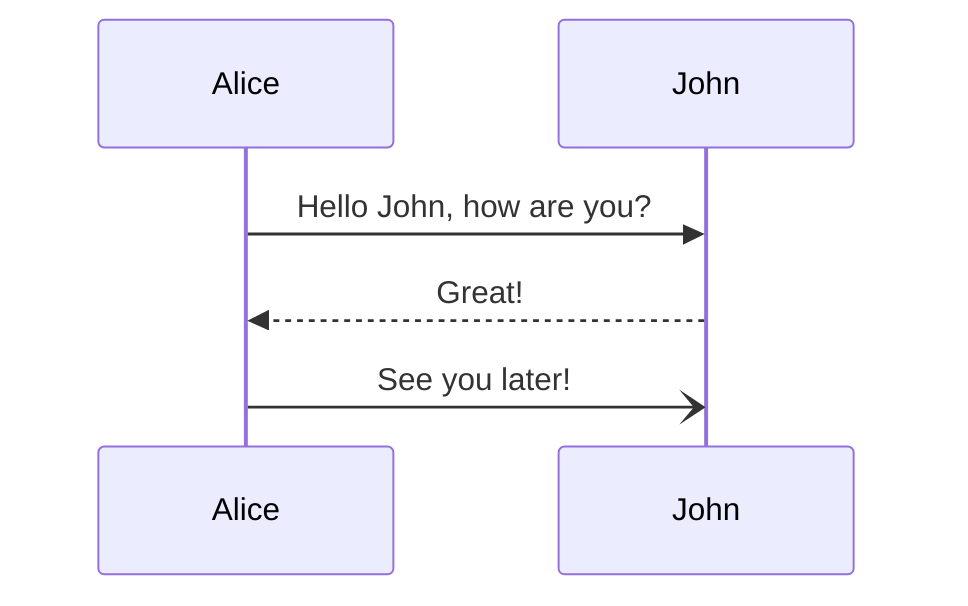

<nav style="margin: 2px auto;">
  <ol style="padding: 0px; display: flex; gap: 8px; list-style-type: none; align-items: baseline; justify-content: space-between; width: 100%;">
    <li>
      <a href="/src/hello">Hello</a>
    </li>
    <li>
      <a href="/src/resume">Resume</a>
    </li>
    <li>
      <a href="/src/resume">Demos</a>
    </li>
    <li style="font-size: 120%">
      <a href="/src/resume">Big Thoughts</a>
    </li>
    <li style="font-size: 80%">
      <a href="/src/resume">Small Thoughts</a>
    </li>
  </ol>
</nav>

Table of Contents

[[toc]]

## Run backend with deno  

- need way for typescript in vscode to be happy, this took some setup
  - fs:
    - [tsconfig.app.json](/tsconfig.app.json)
    - [tsconfig.node.json](/tsconfig.node.json)
    /vscode.json
- making code vite and deno compatible
  - you must appease the typescript language service by using vscode-deno plugin and configuring vscode-deno to target specific files or folders
  - you do this via:
    - fs
      - .vscode/settings.json
        - #deno.enabledPaths = [...$DenoReachable_FileOrFolders]
        - #deno.config: "src/deno.json"
  - you also need to appease the deno module system, so anytime you have a `dual` file type that requires normal looking old style imports like `import {} from 'rxjs'`, you must add an entry mapping this in the import maps
    - `deno.json#imports[$NodeModule] = "jsr:$NodeModule"`

1. requires setting up 2 tsconfig.json
1. I chose to make deno.mts/dual.mts be deno-reachable files
1. Import maps for deno for importing like normal vite resolver when it comes to npm packages
1. .dual.mts indicates running in both vite and deno
## Run frontend with vite
1. Normal vite setup, make sure separate tsconfig for DOM lib config.
1. All non deno/dual files will be considered DOM files for vite
1. For vite, must override the entrypoints in the build config to allow multiple html entrypoints.
## Making a file watcher in Deno with RxJS
1. If you convert 

